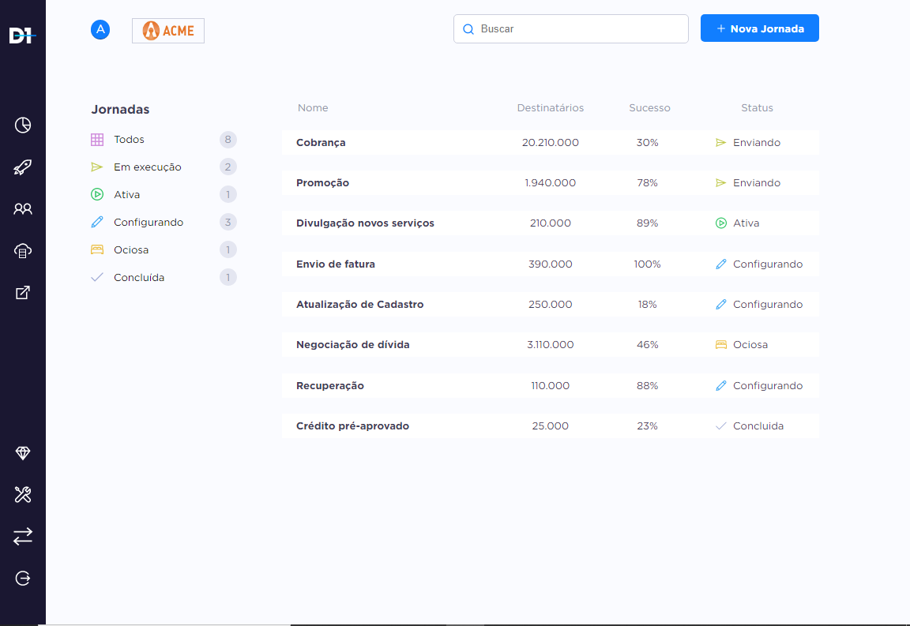

<h1 align="center">
    
</h1>

 
  Este é um projeto com fins educativos, eu construi uma aplicação que
  consome dados de uma api do heroku, com esses dados ela monta um filtro 
  de informações e a partir deste filtro monta uma tabela. 

## Aplicação Web

### Home 

    

## Funcionalidades

* Listar dados;

* Aplicar filtro.

## Para rodar a aplicação

  * A primeira coisa é executar o comando yarn ou npm install,
  para instalar todas as dependencias necessárias.

  * Após a execução do comando yarn ou npm install efetue yarn start
  ou npm start, para rodar a aplicação.

## Tecnologias

  * ReactJS (Web Front-End);

  * Axios (Para usar os dados do Back-End);

  * React-Router-Dom (Configuração de rotas).

